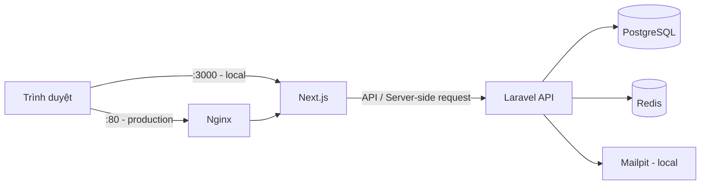

# TeamFlow

TeamFlow là ứng dụng quản lý hồ sơ cá nhân và portfolio. Người dùng có thể quản lý thông tin cá nhân, kinh nghiệm, học vấn, kỹ năng, dự án, bài viết, chứng chỉ và CV; đồng thời xuất bản portfolio công khai theo username.

## Công nghệ sử dụng

| Thành phần | Công nghệ |
| --- | --- |
| Frontend | Next.js 16, React 19, TypeScript, Tailwind CSS |
| Backend | Laravel 13, PHP 8.3, Laravel Sanctum |
| Database | PostgreSQL 17 |
| Cache / queue / session | Redis 8 |
| Email khi phát triển | Mailpit |
| Hạ tầng | Docker Compose, Nginx |

## Kiến trúc



Trong môi trường production, Nginx nhận request cho `teamflow.local` và chuyển đến Next.js; request cho `api.teamflow.local` được chuyển đến Laravel PHP-FPM.

## Chức năng chính

- Đăng nhập và xác thực bằng Laravel Sanctum.
- Dashboard quản lý profile, kinh nghiệm, học vấn, kỹ năng và công nghệ.
- Quản lý dự án, ảnh, liên kết, tính năng và technologies của từng dự án.
- Quản lý bài viết blog, chứng chỉ và mẫu CV.
- Portfolio và trang chi tiết dự án công khai.
- Quản trị người dùng và dashboard dành cho admin.

## Cấu trúc thư mục

```text
teamflow/
├── backend/                 # Laravel REST API
│   ├── app/                 # Controllers, models và nghiệp vụ
│   ├── database/            # Migrations, seeders và factories
│   ├── routes/api.php       # Khai báo API routes
│   └── Dockerfile           # Image cho môi trường local
├── next-app/                # Next.js frontend
│   ├── app/                 # Pages, layouts và API routes
│   ├── components/          # UI và các component theo tính năng
│   └── lib/                 # API client và tiện ích dùng chung
├── nginx/nginx.conf         # Reverse proxy production
├── docker-compose.yml       # Môi trường phát triển
└── docker-compose.prod.yml  # Môi trường production
```

## Yêu cầu

- Docker Desktop hoặc Docker Engine kèm Docker Compose v2.
- Git.

Nếu không dùng Docker, cần cài PHP 8.3+, Composer, Node.js 22+, PostgreSQL 17 và Redis 8.

## Chạy môi trường local bằng Docker

### 1. Tạo file biến môi trường

Tạo file `.env` ở thư mục gốc:

```env
POSTGRES_DB=teamflow
POSTGRES_USER=teamflow
POSTGRES_PASSWORD=thay-mat-khau-an-toan

REDIS_PORT=6379
MAILPIT_SMTP_PORT=1025
MAILPIT_WEB_PORT=8025
```

Tạo file môi trường Laravel từ file mẫu:

```bash
cp backend/.env.example backend/.env
```

Trong `backend/.env`, dùng các giá trị sau cho kết nối Docker:

```env
APP_URL=http://localhost:8000
DB_CONNECTION=pgsql
DB_HOST=postgres
DB_PORT=5432
DB_DATABASE=teamflow
DB_USERNAME=teamflow
DB_PASSWORD=thay-mat-khau-an-toan

REDIS_HOST=redis
REDIS_PORT=6379
MAIL_HOST=mailpit
MAIL_PORT=1025
```

Tạo `next-app/.env.local`:

```env
NEXT_PUBLIC_APP_URL=http://localhost:3000
NEXT_PUBLIC_API_URL=http://localhost:8000
LARAVEL_API_URL=http://laravel:8000
```

> Không commit bất kỳ file `.env` nào. Repository chỉ giữ `backend/.env.example` làm file mẫu.

### 2. Khởi động services

```bash
docker compose up -d --build
```

### 3. Cài dependencies, tạo app key và database

```bash
docker compose exec laravel composer install
docker compose exec laravel php artisan key:generate
docker compose exec laravel php artisan migrate --seed
docker compose exec next npm install
```

### 4. Chạy Next.js development server

```bash
docker compose exec next npm run dev
```

Mở các địa chỉ sau:

| Dịch vụ | Địa chỉ |
| --- | --- |
| Frontend | http://localhost:3000 |
| Laravel API | http://localhost:8000/api/ping |
| Mailpit | http://localhost:8025 |
| PostgreSQL từ máy host | `localhost:5432` |
| Redis từ máy host | `localhost:6379` |

## API chính

Base URL local: `http://localhost:8000/api`

| Nhóm | Endpoint tiêu biểu |
| --- | --- |
| Xác thực | `POST /login`, `POST /logout`, `GET /me` |
| Portfolio công khai | `GET /portfolio/default`, `GET /portfolio/{username}`, `GET /portfolio/projects/{slug}` |
| Profile | `POST /profile`, `PUT /profile` |
| Nội dung | Resource API cho `experiences`, `educations`, `skills`, `projects`, `blog-posts`, `certificates` |
| Dự án | Images, links, features và technologies của từng project |
| Quản trị | `GET /dashboard`, quản lý technologies và users |

Các endpoint ngoài portfolio và login yêu cầu cookie/xác thực Sanctum. Toàn bộ route được định nghĩa tại [backend/routes/api.php](backend/routes/api.php).

## Kiểm tra chất lượng

```bash
# Backend tests
docker compose exec laravel php artisan test

# Frontend lint
docker compose exec next npm run lint
```

## Triển khai production

Tạo `.env.production` ở thư mục gốc, chứa các biến như `APP_KEY`, `DB_DATABASE`, `DB_USERNAME`, `DB_PASSWORD`, `APP_URL`, `SESSION_DOMAIN`, `SANCTUM_STATEFUL_DOMAINS`, `CORS_ALLOWED_ORIGINS` và các URL của Next.js. File này không được commit.

Nếu deploy trên máy local với domain mẫu, thêm vào file hosts:

```text
127.0.0.1 teamflow.local api.teamflow.local
```

Build và chạy production:

```bash
docker compose --env-file .env.production -f docker-compose.prod.yml up -d --build
docker compose --env-file .env.production -f docker-compose.prod.yml exec laravel php artisan migrate --force
```

Nginx mở port `80` và `443`; PostgreSQL được map ra `5433` trên máy host trong cấu hình production.

## Các lệnh Docker hữu ích

```bash
# Xem log tất cả services
docker compose logs -f

# Dừng services local
docker compose down

# Xem trạng thái container
docker compose ps

# Mở Laravel Tinker
docker compose exec laravel php artisan tinker
```

## Bảo mật

- Không commit `.env`, `.env.production`, database dump hoặc thư mục backup.
- Dùng mật khẩu database mạnh và `APP_KEY` riêng trên production.
- Khi một secret từng bị push lên Git, hãy thay mới secret đó; việc thêm `.gitignore` không xóa secret khỏi lịch sử Git cũ.
